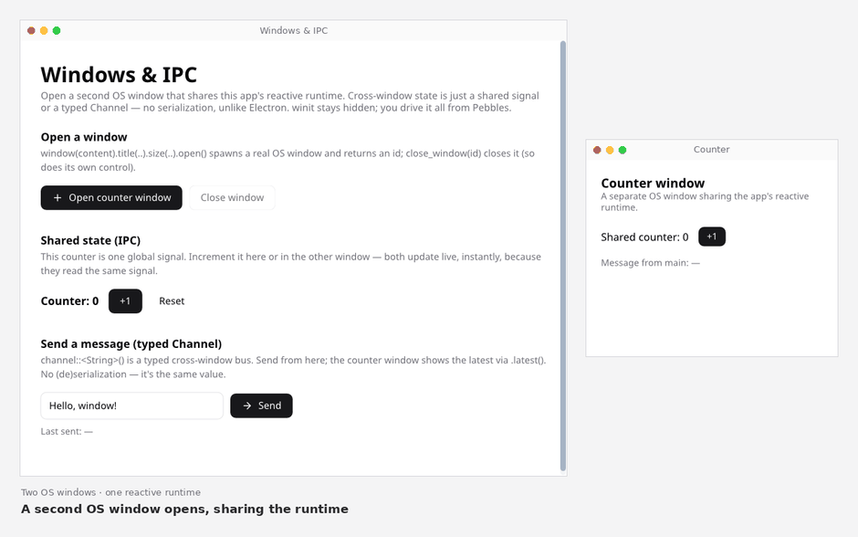

# Pebbles

[](https://github.com/pebbles-hq/pebbles/actions/workflows/ci.yml)
[](https://github.com/pebbles-hq/pebbles/actions/workflows/security.yml)
[](https://scorecard.dev/viewer/?uri=github.com/pebbles-hq/pebbles)
[](LICENSE)
[](rust-toolchain.toml)
[](#platform-support)

A **Flutter-style, desktop-first GUI framework** for Rust, built on
[Vello](https://vello.dev) (GPU 2D rendering) and the Linebender stack
(kurbo · peniko · parley).

Pebbles keeps Flutter's **UI-building syntax** — `Row`/`Column`/`Container`/`Text`,
the box layout protocol, a rich themed widget catalog — but swaps Flutter's
`StatefulWidget`/`setState` boilerplate for **SolidJS-style reactivity**: signals,
memos, effects, and plain **function components**. The result is Flutter's
familiarity with a fraction of the ceremony, in idiomatic Rust.

> Status: early but broad. Catalog, reactivity, layout, text editing (incl. **IME/CJK**),
> scrolling, theming (**live light/dark**), **multi-window + IPC**, **async data**, and an
> **AccessKit accessibility** layer are all real and demonstrated in the gallery. It's a
> personal project and the foundation for **Gravel**, an IDE built on top of it — but it
> stands on its own.

```rust
use pebbles::prelude::*;

fn counter() -> impl IntoWidget {
    let count = create_signal(0); // local state, SolidJS-style

    center(column(children![
        text(format!("{}", count.get())).size(72.0),
        row(children![
            button("−").variant(ButtonVariant::Outline)
                .on_pressed(move || count.update(|c| *c -= 1)), // handler = bare closure
            gap_w(16.0),
            button("+").on_pressed(move || count.update(|c| *c += 1)),
        ])
        .main_axis_size(MainAxisSize::Min), // Flutter's mainAxisSize
    ]))
}

fn main() -> Result<(), Box<dyn std::error::Error>> {
    App::new(component(counter)).title("Counter").size(480, 420).run()
}
```

```bash
cargo run -p counter     # the example above
cargo run -p gallery     # the full widget showcase / documentation
```

## The `pebbles` command

Optional but recommended — install the CLI once and it scaffolds projects and
runs them with hot-restart:

```bash
cargo install --path crates/pebbles-cli   # or: cargo install --git <this repo> pebbles-cli

pebbles create hello                      # a runnable desktop app
pebbles create --template widget my-thing # a reusable widget package
pebbles create --list                     # the available templates

cd hello && pebbles run                   # rich logs; hot-restarts on save
pebbles doctor                            # check the toolchain/environment
```

Generated projects depend on Pebbles by git, so they build on any machine. Pass
`--path` instead to point at a local checkout — that is for working *on* the
framework, where edits should be picked up without publishing.

The CLI is a separate crate that does **not** depend on the framework (it only
shells out to cargo), so it neither bloats an app build nor forces you to use
it: `cargo run` works exactly as well.

Optional integrations are opt-in cargo features on the `pebbles` crate:
`image-view` (`ImageView` + image decoding), `file-dialogs` (`pick_folder`),
`native-menus` (OS menu bar), `global-hotkeys`, and `tokio` (`create_resource`
over a `Future`). A default build links none of them — no image codecs, no HTTP
client, no async runtime.

Widgets can also ship as **separate packages** that depend on Pebbles — the
ecosystem model. The Obsidian-style GFM reader/editor lives in its own crate,
[`pebbles-markdown`](https://github.com/pebbles-hq/pebbles-markdown); add it to
your app alongside `pebbles`. It is the reference example for building your own
Pebbles widget package — and `pebbles create --template widget` scaffolds exactly
that shape (library + example + headless tests).

## Platform support

Pebbles is **desktop-first by design**. "Supported" here means a concrete
claim — the platform builds and passes the headless test suites in
[CI](.github/workflows/ci.yml) — not an aspiration.

| Platform | Status | Notes |
|---|---|---|
| **Linux** (X11 + Wayland) | ✅ Supported | The primary development platform: built, tested and run daily, including GPU device-loss recovery and long input-storm soaks. |
| **Windows** | ✅ Supported | Builds and passes the full suite on `windows-latest` in CI. Native window menu behind `native-menus`. Less interactive polish than Linux — visual/input reports welcome. |
| **macOS** | ✅ Supported | Builds and passes the full suite on `macos-latest` in CI. Has the most platform-specific code (global menu bar, `Mod`→⌘ shortcut mapping). Same interactive-polish caveat as Windows. |
| **Web** (wasm) | 🟢 Runs (WebGPU) | `pebbles run -d web` builds the wasm bundle, serves it, and opens the browser — GPU init is async (no main-thread block), the canvas entry uses winit `spawn_app`, and touch/pointer input works. Requires a **WebGPU** browser (Vello uses compute shaders; no WebGL2 fallback) — Chrome/Edge, Safari 26+, or Firefox with WebGPU. Fully buildable from Linux. |
| **Android** | 🟡 Compiles (entry + runner ready) | Framework **and shell** compile for `aarch64-linux-android` (CI-gated). The `android_main` entry (`#[pebbles::main]`), touch input, and a one-command runner (`pebbles run -d android`, via cargo-apk2) are in place. Requires **Vulkan** (universal on Android 7+). The on-device APK build/run needs the NDK + a device (check `pebbles doctor`); surface suspend/resume + soft keyboard are follow-ups. AccessKit ships an Android adapter, so TalkBack is reachable. |
| **iOS** | 🟡 Compiles | Framework **and shell** compile for `aarch64-apple-ios` (Metal — no GPU caveat), gated on the CI macOS runner. **Touch input works** (shared with Android). Not yet a running app: needs the app-bundle entry and the on-device build, which **requires a Mac + Xcode** (Apple's constraint — no Linux/Windows path). |

Legend: ✅ built + tested in CI · 🟢 runs (WebGPU browser) · 🟡 compiles in CI,
not yet runnable · ⛔ not supported.

Run on any target with Flutter-style `-d`: `pebbles run` (desktop, the default),
`pebbles run -d web` (needs [Trunk](https://trunkrs.dev): `cargo install --locked
trunk`). **Per-capability compatibility** (which widgets/features run where, and
how to detect the platform in code) is documented in
[`PLATFORMS.md`](PLATFORMS.md). The desktop rows are produced by the CI matrix, and the web/Android/iOS
**compile** status by the [`cross-platform`](.github/workflows/ci.yml) gate, on
every push — so this table cannot silently drift. Android and iOS say "compiles"
rather than "runs" honestly: the source + dependency graph build and touch input
is wired, but a *running* app still needs each one's entry point and a build
toolchain this project doesn't bundle (an NDK + device for Android, a Mac for
iOS). The remaining work is tracked in full, honest checklists in the project's
platform design docs.

## Programming model

- **UI syntax is Flutter.** `column(children![a, b, c])` mirrors `Column(children: [...])`,
  `container().color(..).padding(..)`, `Row`/`Expanded`/`Stack`, the constraints-down /
  sizes-up box layout — a Flutter developer is immediately at home. **One children syntax:**
  the `children![…]` list literal for fixed children, a `Vec` (`.map(..).collect()`) for
  computed ones — same as Dart's list literal vs `.toList()`.
- **State is SolidJS.** No `StatefulWidget`, no `setState`. Local *and* global state use
  the same `create_signal` primitive; reads auto-subscribe, writes re-render only the
  components that read them. Plus `create_memo` (equality-deduped), `create_effect`,
  `create_store`, `create_cleanup`.
- **Components are functions.** `fn my_widget() -> impl IntoWidget`, mounted with
  `component(..)` (or `component_props(..)` for parameterized, reusable widgets).
- **Handlers are plain closures.** `.on_pressed(move || count.update(..))`. An
  event-carrying handler is `action_event(move |e| ..)`; the explicit `action(..)`
  wrapper still exists but is rarely needed.

### View-function rules (the top-3 FAQ)

1. **A view is a plain `fn` returning its root widget — there is no `widget()`/`view()`
   wrapper and there never should be.** Helpers like the gallery's `screen()` are optional
   app vocabulary, not required chrome.
2. **No local state → plain fn, call it directly. Local state
   (`create_signal`/`animated`/`create_focus`) → it's a component: mount it via
   `component(..)`/`component_props(..)`** so its signals get an owner and it re-renders
   independently. Calling a signal-creating fn directly charges its hooks to the *parent*
   (a debug assertion catches this).
3. **Return-type convention:** public view/component boundaries return `Element`; private
   helpers may return concrete types (`Container`, `Row`, …) for zero boxing.

## Architecture

Flutter's **three trees**, made Rust-native:

```
Widget       (immutable config, rebuilt freely)
  │  reconcile
Element      (retained; the reactive owner)   ← arena: SlotMap<ElementId, …>
  │  create / update
RenderObject (layout + paint into a vello::Scene) ← arena: SlotMap<RenderId, …>
  │  vello + wgpu
GPU surface  (winit window)
```

- **Box layout, verbatim:** constraints go down, sizes come up, the parent sets the
  position.
- **Arenas, not `Rc<RefCell>`:** a parent lays out its children (mutating siblings while
  being mutated). Each node lives in a generational [`slotmap`] arena; to recurse, the
  framework lifts the child's boxed object out, recurses with a hole-free `&mut` tree, and
  puts it back — no aliasing, no borrow panics.
- **Reactivity engine:** a thread-local runtime tracks which components read each signal; a
  write schedules exactly those components, which re-render and reconcile. Dioxus-like
  internals, Solid-like API.

### Threading & update model

- **Single UI thread.** Signals, the runtime and every widget are **not `Send`** — all UI
  work happens on the thread that runs the event loop. Background work uses `spawn` /
  `create_resource`, which run a `std::thread` and hand the result **back to the UI thread**
  (drained each frame) before it touches any signal.
- **Update granularity is per-component, then reconcile.** A signal write marks the
  components that read it dirty; each re-runs its function and the result is *reconciled*
  against the retained element tree (only changed render objects are updated). This is
  Solid's **API**, not Solid's per-node DOM granularity — the unit of re-render is the
  function component, and `create_memo` dedupes by value so an unchanged derived value
  doesn't wake its readers.

### Crates

Layered so the GPU stack is quarantined and the core compiles in seconds:

| Crate | Responsibility |
|-------|----------------|
| [`pebbles-foundation`](crates/pebbles-foundation) | geometry (kurbo), layout enums, color + the full Tailwind/shadcn palette |
| [`pebbles-render`](crates/pebbles-render) | `BoxConstraints`, render tree, layout/paint, text (parley), icons, accessibility nodes |
| [`pebbles-core`](crates/pebbles-core) | the runtime: `Widget`/`Element`, reconciler, reactivity, focus, keyboard, animation, async tasks, IPC, clipboard |
| [`pebbles-widgets`](crates/pebbles-widgets) | the catalog: primitives + shadcn-style components, theme, styling, overlays, dialogs, windows |
| [`pebbles-shell`](crates/pebbles-shell) | winit window + wgpu surface + Vello GPU renderer + event loop + AccessKit bridge |
| [`pebbles-testing`](crates/pebbles-testing) | the headless test harness: mount, frame/draw, input, queries |
| [`pebbles`](crates/pebbles) | umbrella crate + `prelude` + the [`hooks`](crates/pebbles/src/hooks.rs) index |
| [`pebbles-cli`](crates/pebbles-cli) | the `pebbles` command: scaffold, dev-run with hot-restart, doctor |

`vello`'s GPU deps are optional, so `pebbles-render` uses the CPU-side `vello::Scene`
encoder with **no** wgpu — keeping layout/paint logic unit-testable headlessly. Only
`pebbles-shell` links the GPU renderer.

## What's in the box

Everything below is built and shown in `cargo run -p gallery`, styled to **shadcn**.

- **Layout & primitives** — `Text`, `Container`, `Row`/`Column` (Flutter's
  `.main_axis_alignment()/.cross_axis_alignment()/.main_axis_size()/.spacing()`),
  `Expanded`/`Flexible`/`spacer`, `gap_w`/`gap_h` (fixed gaps),
  `Stack`/`Positioned`, `Padding`, `Align`/`center`, `SizedBox`, `ConstrainedBox`,
  `DecoratedBox`, `Opacity`, `ClipRRect`, `Wrap`, `AspectRatio`, `Icon`, `Spinner`,
  `ScrollArea`, `Resizable`, `Separator`; child-first modifiers (`.padded()/.centered()/
  .expanded()/.sized()/.clipped()/.opacity()`).
- **Icons** — the full **Lucide** set (~1800 glyphs), addressable by const (`lucide::CAMERA`),
  by name, or via `IconKind`. Icons are plain data, so your own drop in anywhere.
- **Gestures** — `GestureDetector` with the full pointer set: tap, double-tap,
  secondary/tertiary click, the long-press lifecycle, hover enter/exit, and drag/pan.
- **Buttons** — `Button` (Primary/Secondary/Outline/Ghost/Destructive/Link · Sm/Md/Lg ·
  custom colors · leading/trailing icons · `.shadow()` · `.loading()` · full event set ·
  focus ring + keyboard activation), `IconButton`, `ButtonGroup`, `ToggleGroup`.
- **Text inputs** — a full editor with **IME / CJK composition** (underlined preedit), selection,
  system clipboard (Ctrl+A/C/X/V), undo/redo, word navigation, and mouse (click-to-caret,
  drag-select, double-click word, shift-click). Input types: `text_field`, `text_area`,
  `password_field`, `search_field`, `email`/`number`/`url`/`phone`, `date_field` (calendar
  popover), plus `Field` (label/description/error wrapper), `Combobox`/`MultiSelect`.
- **Selection controls** — `Select`, `Slider`, animated `Checkbox`/`Switch`/`Radio`/`Toggle`,
  `RadioGroup`, `Progress`.
- **Scrolling** — `SingleChildScrollView` with **spring physics** and a customizable
  scrollbar; **virtualized** `ListView::builder`/`GridView::builder`; a `ScrollController`;
  keyboard scrolling; nested-scroll bubbling.
- **Surfaces & data** — `Card`, `Badge`, `Alert`, `Avatar`(+group), `Separator`, `Skeleton`
  (+shimmer), `Kbd`, `Empty`, `ListTile`, `Table`, `TreeView`, typography helpers.
- **App chrome** — `Scaffold`, `SideNav`, `TopPanel`, `BottomNav`, `Tabs`, `SplitView`,
  `Panel`, `Accordion`/`Collapsible`, `Breadcrumb`/`Pagination`/`Toolbar`/`StatusBar`.
- **Overlays, dialogs & windows** — a **per-window** overlay layer (dropdowns/popovers), modal
  `Dialog` + `AlertDialog`, and real **secondary OS windows** (`window()`) that share the one
  reactive runtime — cross-window communication is a shared signal or a typed `Channel<T>`, no
  serialization (unlike Electron IPC). Window knobs: min/max size, position, resizable,
  maximized, decorations, icon, and runtime `set_title`/maximize/minimize/move/focus.
- **Async** — `spawn(work, on_done)` and `create_resource(fetcher) -> Signal<Resource<T>>`
  (SolidJS-style `Loading → Ready`) run background work off-thread and deliver results on the
  UI thread.
- **Accessibility** — an AccessKit bridge (AT-SPI / UIA / VoiceOver): interactive widgets
  publish role/label/value/toggled/disabled + bounds, and keyboard focus is announced.
- **Theming & styling** — a **reactive** global `Theme` (shadcn light/dark; `toggle_theme()`
  flips the whole tree live), the complete Tailwind/shadcn palette, and a CSS-like `Style`
  system applicable to any widget.
- **Animation** — a spring + tween driver (`animated`/`animate_to`), a looping ticker
  (`create_loop`) and a one-shot `create_timeout`, behind hover fades, sliding switches,
  focus rings and spinners.

## Styling

One universal **`Style`** — React-Native's `StyleSheet`, not Flutter's per-widget style
objects. A `Style` is a bag of optional properties that applies where it makes sense and
no-ops where it doesn't (text props on a box do nothing); define styles as functions and
layer them like CSS classes:

```rust
fn card() -> Style {
    style().background(theme().colors.card).radius_all(12.0).padding_all(16.0)
}

column(children![..]).styled(card());              // box props wrap any widget
text("Title").style(card().merge(style().bold())); // text props style the glyphs
card_widget().style(style().background(palette::red::S50)); // components merge (user wins)
let s = styles([base, brand, style().radius_all(20.0)]);    // RN style={[a, b, c]}
```

Box props (padding · margin · size · min/max · aspect · border incl. per-side · radius ·
shadow · gradient · image · blend · opacity · align · transform · cursor) apply via
`.styled(..)` around any widget. Text props (color · size · weight · line-height · align ·
letter-spacing · italic · underline · strikethrough · font-family · max-lines) apply via
`Text` (or a component that draws text). Layout stays a widget's job: no `overflow`
(scrolling is a widget), no `position` (Stack/Positioned), no per-state styles (those are
semantic component knobs).

## Testing

Layout, the whole reconcile loop, reactivity, IME, async, accessibility, per-window
isolation and the styling system are all proven **without a GPU or window**:

```bash
cargo test          # headless: mount a real tree, dispatch taps/keys/IME, assert
```

The headless engine tests mount a real widget tree, dispatch taps and keystrokes, and
assert the render (and accessibility) trees change — driving `input → signal write →
reconcile → relayout` end to end in-process.

Use [`pebbles-testing`](crates/pebbles-testing) rather than re-deriving the frame
pipeline in each test:

```rust
use pebbles_testing::Harness;

let mut h = Harness::new().window(500.0, 200.0);
h.mount(my_component);
h.draw();                        // reconcile → layout → paint, settled
h.click(Offset::new(20.0, 9.0));
assert!(h.render_node_count() < 900);
```

`Harness::new()` initializes every global service (theme, overlay, dialog, sheet,
focus, animation) and `mount` adds the `View` + `OverlayHost` wrapper the shell
would, so overlays and popovers behave as in a real app. `draw()` loops the
corrective relayout until geometry settles — paint can invalidate the layout it
just ran on — so a test cannot assert against unsettled geometry.

## Status

| Area | State |
|------|-------|
| Reactivity (signals/memos/effects/stores, memo dedup) | ✅ |
| Layout + box protocol, flex, stack, scroll (spring + virtualized) | ✅ |
| Widget catalog (shadcn-style; most of the useful subset) | ✅ broad |
| Text editing + IME/CJK composition | ✅ |
| Theming (reactive light/dark) + styling | ✅ |
| Multi-window + cross-window IPC (`Channel`) | ✅ |
| Async (`spawn` / `create_resource`; optional `tokio` feature) | ✅ |
| Accessibility (AccessKit: read + focus + AT-driven Focus/Click actions) | ✅ |
| Per-window overlays + dialogs | ✅ |
| Catalog long-tail (Tooltip, Toast, Popover, ContextMenu, Sheet, Command, HoverCard, InputOTP, Menubar) | ✅ |
| Carousel, custom-paint `canvas` | ✅ |
| Charts | ⏭ planned (design done; `canvas` is the substrate) |
| Desktop CI matrix (Linux/Windows/macOS) + supply-chain gates | ✅ |

### Two windows, one runtime (live IPC)



The main **Windows & IPC** screen and a second OS window share the *same*
`create_signal` counter and a typed `Channel<String>` — increment or send from
one window and the other updates instantly, with no serialization (unlike
Electron's `postMessage`). The still strip is [`demo/windows-ipc-strip.png`](demo/windows-ipc-strip.png).

Both assets are rendered straight from the gallery, headless and reproducibly —
`GALLERY_CAPTURE=<dir> cargo run -p gallery --release` rasterizes each window
through vello off-screen, then `python3 demo/build_demo.py <dir> demo` composites
the strip and GIF. No screenshot tool or display server required.

## Roadmap

Shipped since the first cut, and no longer on this list: variable-height list
virtualization (`ListView::builder_auto` with per-item extent estimates), the
keyboard shortcut map (`create_shortcut`) with the optional native menu bar and
global hotkeys, the `#[component]` authoring macro, the widget inspector, RTL /
`TextDirection`, spring animations + presence transitions, and the custom-paint
`canvas`.

Open, roughly in order:

- **Charts**, built on `canvas`.
- **Sticky / collapsing list headers.**
- **The editor's remaining lazy path** — a huge document's cold mount is
  windowed, and per-keystroke cost is one line; syntax highlighting inside the
  editor pane is still reader-only.
- **`SetValue` accessibility actions** (slider/text), following the shipped
  Focus/Click ones.
- **Mobile**, if it happens: the framework crates already compile for iOS and
  Android — what is missing is touch/gesture input, app lifecycle, and a
  clipboard backend. See [Platform support](#platform-support).

> **Update granularity:** re-renders are per-component (Solid's model), not
> per-signal-binding — a signal write re-runs the components that read it. AT-driven
> `SetValue` (slider/text) is a follow-up to the shipped Focus/Click actions.

## Documentation

| Document | What's in it |
|---|---|
| [ARCHITECTURE.md](ARCHITECTURE.md) | crate layering, the three trees, the frame pipeline, and a "where does this change belong" table |
| [WIDGETS.md](WIDGETS.md) | the full catalog with per-widget status and notes |
| [CONTRIBUTING.md](CONTRIBUTING.md) | how to build, test and land a change |
| [SECURITY.md](SECURITY.md) | private vulnerability reporting, the threat model, and the CI hardening gates |
| [CHANGELOG.md](CHANGELOG.md) | what changed, newest first |
| [`pebbles::hooks`](crates/pebbles/src/hooks.rs) | every hook in one indexed place, grouped by purpose |

API docs: `cargo doc --open`.

## License

Licensed under the **Apache License, Version 2.0** — see [LICENSE](LICENSE) and
[NOTICE](NOTICE).

Copyright © 2026 Reyco Seguma.
